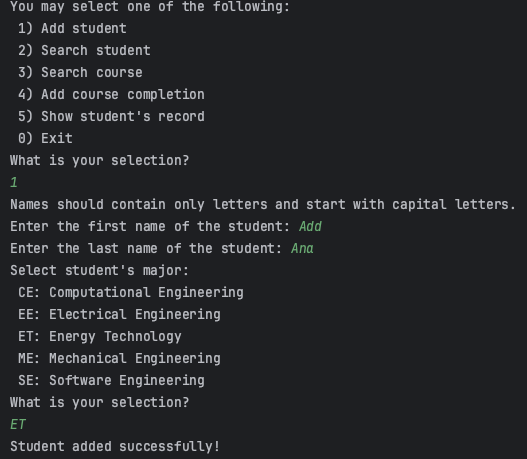
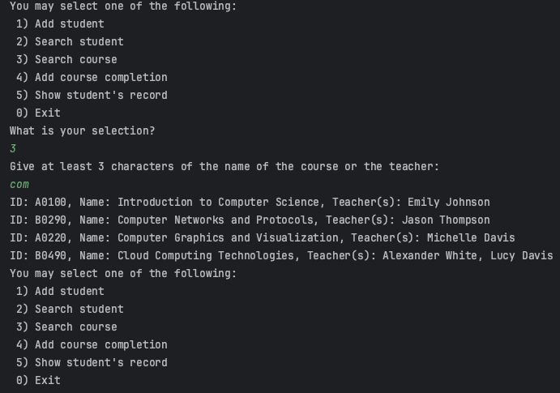

## Interactive Student Management System (Basic Version)

English｜[中文](./readme_ch.md)

a study register for a university.

Your system will rely on three text files, which contain the data needed to run the system. The idea is that while running your program, the content of these files change. 

## 特点

- Python 3.9
- File storage instead of a database
- No frontend pages, pure backend interaction

## Results Display

## Usage
- Clone the project to your local machine and open it using PyCharm.
- Navigate to the Main.py file and run the main() method.