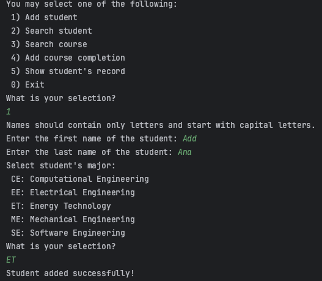

## 互动式学生管理系统（基础版）

[English](./README.md)｜中文

Python 交互式的学生管理系统。[点击查看详细要求](./resource/Python_2023_project.pdf)

系统将依赖三个文本文件，这些文件包含运行系统所需的数据。在运行程序时，这些文件的内容会发生变化。

- [详情_1](./resource/detail1.png)
- [详情_2](./resource/detail2.png)
- [详情_3](./resource/detail3.png)
- [详情_4](./resource/detail4.png)

## 特点
- Python 3.9
- 文件存储代替数据库
- 无前端页面，纯后端交互

## 结果展示

## 使用方法
- 将项目 `clone` 至本地，使用 `PyCharm` 打开。
- 进入 `Main.py` 文件，运行 `main()` 方法。